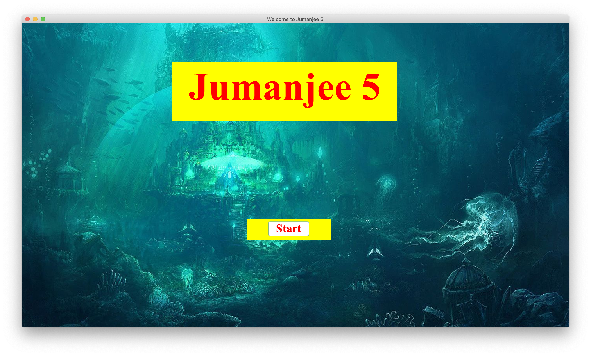
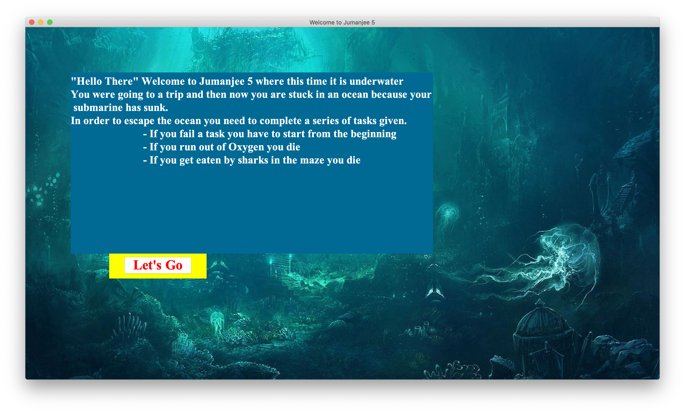
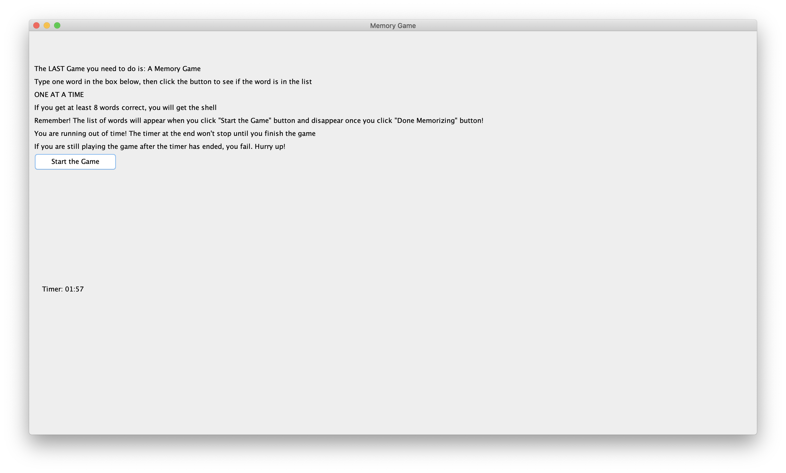
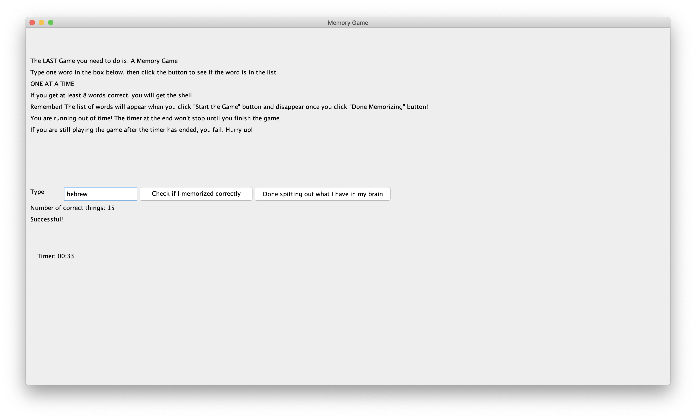
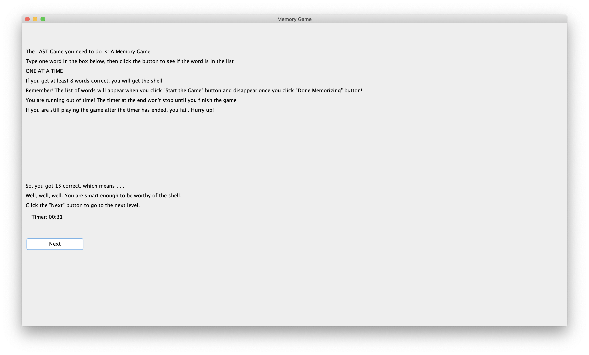
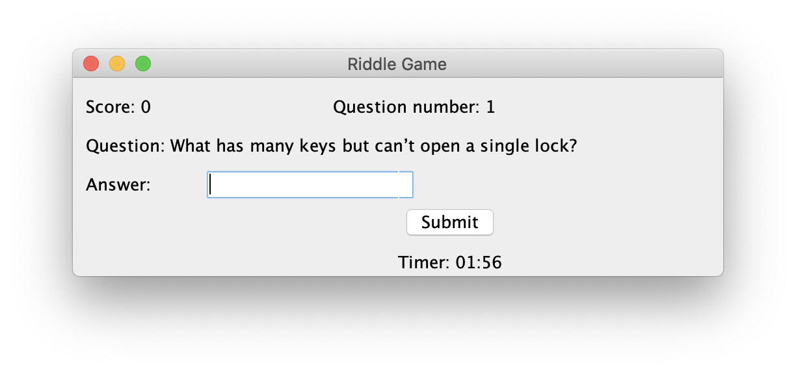
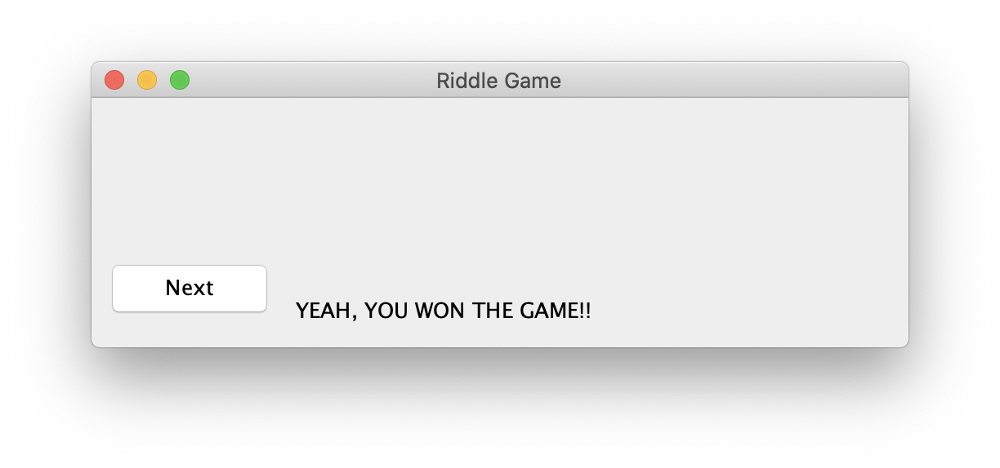
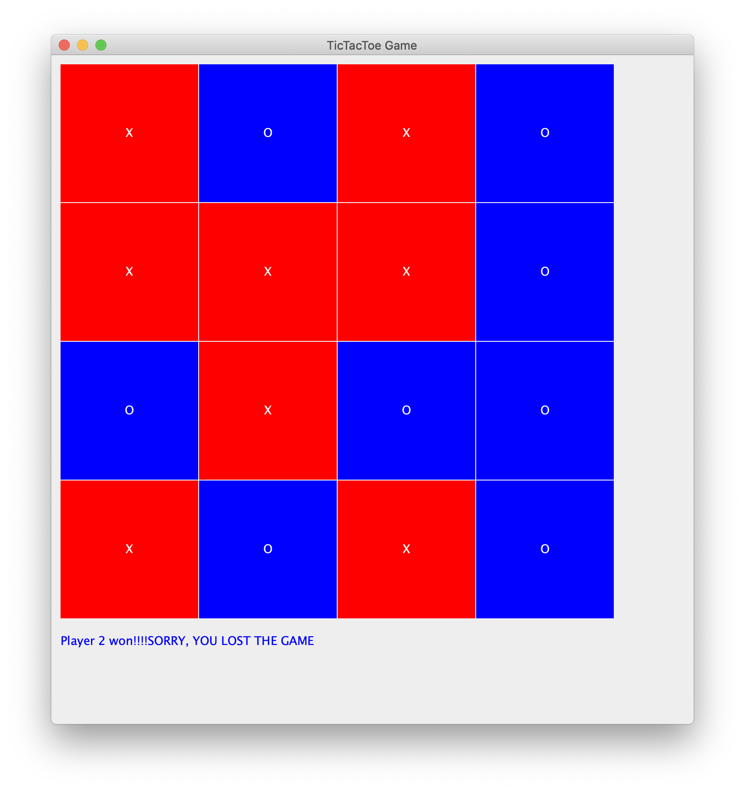

# Jumanjee 5
2020 Java Final Team Project

Our Jumanjee 5 is a story-driven game where a user has to win multiple games in order to escape the maze.

*(I want to keep this (This is meaningful))*

~~(Say your name and what thing you're doing in the project)~~

~~Omg hi this is aarushi and im trying to figure out how commits work but im pretty sure this is how you do it. Also Im doing the scramble word part in our game!~~

~~Hi this is Priyanka and im making the riddle game part of the game. I am also working on the GUI of the game.~~

~~Hi this is Rachel and I'm working on the Memory/List game. I'm having some trouble with showing the list and removing the list from the UI after 30 seconds.~~

~~Hi this is Vinuthna and I'm working on Making tic-tac-toe with computer. There are alot of confusing 2d arrays to use in it.~~

~~Hi this is Serena and I'm working on our sliding tile game. Right now I have finished most of the work for the game and am moving on to the graphics for it.~~

~~Hi this is Satkeerth and I'm working/learning on graphics for the game.~~
